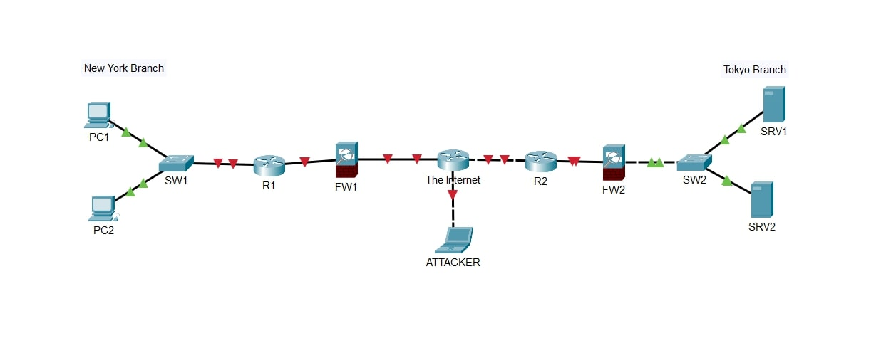

# Lab: Network Devices

**Date:** 2025-05-20  
**Tool:** Cisco Packet Tracer  
**Lab File:** `network-devices.pkt`

---

## 🎯 Objective
- Learn to add and connect devices in Packet Tracer.
- Practice using the **Automatically Choose Connection Type** function.

---

## 📋 Lab Instructions
1. Use the following devices:
   - Cisco 2911 Routers × 2
   - Cisco 2960 Switches × 2
   - Cisco 5505 Firewalls × 2
   - PCs × 2
   - Servers × 2
   - Laptop (as "Attacker")
2. Connect the devices using Packet Tracer's **Automatically Choose Connection Type**.
3. Label devices as shown in the diagram.
4. Arrange devices according to the given network layout.

---

## 📝 Lab Topology

### Final Topology

---

## 🔧 Steps Performed
1. Opened Packet Tracer and created a new project.
2. Added required devices from the device list.
3. Placed devices and labeled them:
   - PC1, PC2 → New York Branch
   - SRV1, SRV2 → Tokyo Branch
   - Labeled “ATTACKER” for the laptop connected to the internet.
4. Connected devices using the **Automatically Choose Connection Type** tool.
5. Saved the project as `.pkt`.

---

## ✅ Result
The network topology was successfully created in Packet Tracer according to the given instructions.

---

## 📂 Files in this folder
- `network-devices.pkt` → Packet Tracer lab file  
- `topology.jpg` → Final topology screenshot  
- `README.md` → Lab documentation
