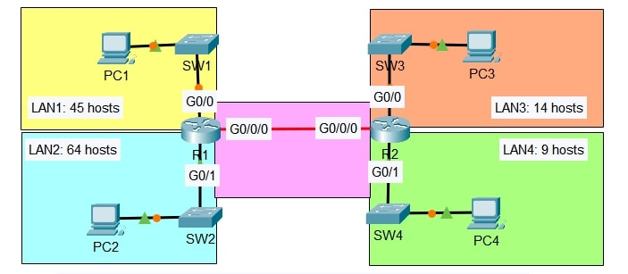

# Lab: VLSM Network Design

**Date:** 2025-11-26
**Tool:** Cisco Packet Tracer  
**Lab File:** `vlsm_network_design.pkt`

---

## 🎯 Objective
- Design a network using VLSM subnetting.
- Allocate IP addresses based on host requirements.
- Configure router interfaces with correct IP addressing.
- Implement static routing so all PCs can communicate.

---

## 📋 Lab Instructions
1. Use the network 192.168.5.0/24 for subnetting.
2. Create subnets for the following LANs:
   - LAN1: 45 hosts
   - LAN2: 64 hosts
   - LAN3: 14 hosts
   - LAN4: 9 hosts
3. Create a point-to-point connection between R1 and R2.
4. Assign:
   - First usable IP address to the PC in each LAN.
   - Last usable IP address to the router interface in each LAN.
5. Configure static routes on both routers.
6. Verify connectivity using ping between all PCs.

---

## 📝 Lab Topology

Final Topology:

---

## Steps Performed
1. Created the topology using:
   - Routers: R1 and R2
   - Switches: SW1, SW2, SW3, SW4
   - End Devices: PC1, PC2, PC3, PC4
2. Connected all devices according to the given diagram.
3. Subnetted the 192.168.5.0/24 network using VLSM.
4. Assigned IP addresses:
   - PCs received the first usable IP of each subnet.
   - Router LAN interfaces received the last usable IP.
5. Configured the point-to-point link between R1 and R2.
6. Configured static routes on both routers.
7. Verified connectivity using ping between all PCs.

---

## ✅ Result
- All LANs were successfully subnetted.
- IP addresses were correctly assigned.
- Static routing was configured successfully.
- All PCs can ping each other without packet loss.

---

## 📂 Files in this Folder
- `vlsm_network_design.pkt` → Packet Tracer lab file  
- `topology.jpg` → Final topology screenshot  
- `README.md` → Lab documentation
