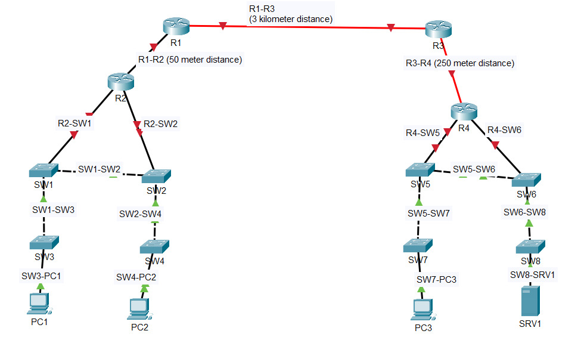

# Lab: Connecting Devices

**Date:** 2025-05-21  
**Tool:** Cisco Packet Tracer  
**Lab File:** `connecting-devices.pkt`

---

## 🎯 Objective
- Create a topology using routers, switches, PCs, and a server.  
- Select correct cable types (copper/fiber) based on distance.  
- Assume **Auto MDI-X is disabled**, so use proper straight-through or cross-over cables manually.  

---

## 📋 Lab Instructions
1. Use the following devices:
   - Routers × 4 (R1–R4)  
   - Switches × 8 (SW1–SW8)  
   - PCs × 3 (PC1–PC3)  
   - Server × 1 (SRV1)  
2. Connect devices as per given distance:
   - R1–R2 → 50m (Copper)  
   - R1–R3 → 3km (Fiber)  
   - R3–R4 → 250m (Fiber)  
   - R2 ↔ SW1 ↔ SW3 ↔ PC1 → Copper  
   - R2 ↔ SW2 ↔ SW4 ↔ PC2 → Copper  
   - R4 ↔ SW5, SW6 → Copper (with SW5–SW6 redundancy)  
   - SW5 ↔ SW7 ↔ PC3 → Copper  
   - SW6 ↔ SW8 ↔ SRV1 → Copper  
3. Label all devices properly.  
4. Save the project file as `.pkt`.  

---

## 📝 Lab Topology

### Final Topology

---

## 🔧 Steps Performed
1. Added all routers, switches, PCs, and server.  
2. Placed them according to the network diagram.  
3. Labeled devices (R1–R4, SW1–SW8, PC1–PC3, SRV1).  
4. Connected them with correct cables (Straight-through, Cross-over, Fiber).  
5. Verified logical connections.  
6. Saved the project as `.pkt`.  

---

## ✅ Result
The topology was successfully created. All devices are connected with correct cable types, and redundant paths were included.

---

## 📂 Files in this folder
- `connecting-devices.pkt` → Packet Tracer lab file  
- `topology.jpg` → Final topology screenshot  
- `README.md` → Lab documentation  
