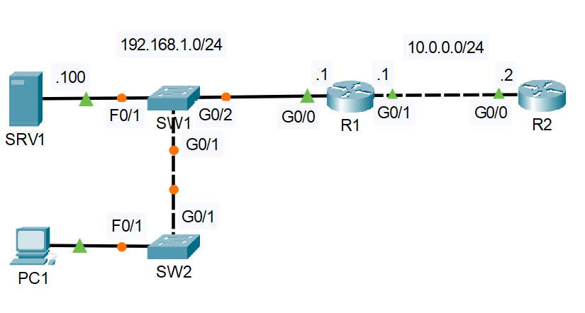

# Lab: OSI Model & TCP/IP SUITE

**Date:** 2025-05-22  
**Tool:** Cisco Packet Tracer  
**Lab File:** `osi-model.pkt`

---

## 🎯 Objective
- Use **Simulation Mode** to observe packet flow across different OSI layers.  
- Identify which OSI layers are used during communication.  
- Generate and analyze **Layer 7 (Application Layer)** traffic using DHCP.  

---

## 📋 Lab Instructions
1. Open the given Packet Tracer project file.  
2. Switch to **Simulation Mode**.  
3. Perform different types of communication (ping, web access, DHCP, DNS, ARP).  
4. Identify which OSI layers are involved for each packet.  
5. On **PC1**, release and renew the IP address using commands:  

ipconfig /release
ipconfig /renew

→ This generates DHCP traffic at Layer 7.  
6. Observe encapsulation/decapsulation of packets across OSI layers.  

---

## 📝 Lab Topology

### Final Topology

---

## 🔧 Steps Performed
1. Opened the lab in Cisco Packet Tracer.  
2. Switched to Simulation Mode to monitor packets.  
3. Sent pings between PCs to check ICMP traffic (Layer 3).  
4. Observed ARP requests/replies (Layer 2).  
5. Released and renewed IP address on PC1 to generate DHCP traffic (Layer 7).  
6. Analyzed packet flow through all OSI layers.  
7. Saved the project as `.pkt`.  

---

## ✅ Result
The OSI Model was successfully analyzed using Simulation Mode.  
Different types of traffic (ARP, ICMP, DNS, DHCP) were generated and their OSI layers were identified.  

---

## 📂 Files in this folder
- `osi-model.pkt` → Packet Tracer lab file  
- `topology.jpg` → Final topology screenshot  
- `README.md` → Lab documentation  
