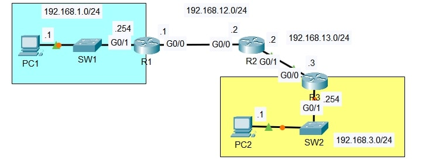

# Lab: Configuring Static Routes

**Date:** 28 October 2025  
**Tool:** Cisco Packet Tracer  
**Lab File:** `configuring_static_routes.pkt`

---

## 🎯 Objective
- Configure **IP addressing** on PCs and routers.
- Understand **static routing** across multiple routers.
- Enable **end-to-end connectivity** between different networks using static routes.
- Verify packet flow using **ICMP (ping)**.

---

## 📋 Lab Instructions
1. Configure PCs and routers according to the network diagram:
   - Hostnames
   - IP addresses
   - Subnet masks
   - Default gateways on PCs  
   *(Switch configuration is not required)*
2. Configure **static routes** on all routers.
   - Ensure **PC1 can successfully ping PC2**.

---

## 📝 IP Addressing Plan

| Network | Purpose |
|--------|---------|
| 192.168.1.0/24 | PC1 LAN |
| 192.168.12.0/24 | R1–R2 link |
| 192.168.13.0/24 | R2–R3 link |
| 192.168.3.0/24 | PC2 LAN |

---

## 📝 Lab Topology

### Final Topology

---

## 🔧 Steps Performed
1. Assigned IP addresses to all PCs and router interfaces as per diagram.
2. Configured default gateways on PC1 and PC2.
3. Configured static routes on:
   - R1 to reach 192.168.3.0/24
   - R2 to reach both edge LANs
   - R3 to reach 192.168.1.0/24
4. Verified routing tables using:
   - `show ip route`
5. Tested connectivity using:
   - `ping` from PC1 to PC2

---

## ✅ Result
- Static routes were successfully configured on all routers.
- PC1 was able to ping PC2 successfully.
- End-to-end connectivity across multiple networks was achieved.

---

## 📂 Files in this folder
- `configuring_static_routes.pkt` → Packet Tracer lab file  
- `topology.jpg` → Final topology screenshot  
- `README.md` → Lab documentation  
