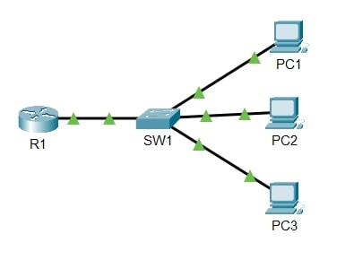

# Lab: Basic Device Security

**Date:** 2025-05-23  
**Tool:** Cisco Packet Tracer  
**Lab File:** `basic-device-security.pkt`

---

## 🎯 Objective
- Learn how to configure basic security on router and switch.  
- Practice hostname configuration.  
- Understand enable password vs enable secret.  
- Apply password encryption and save configuration.  

---

## 📋 Lab Instructions
1. Change the hostnames of the router and switch to **R1** and **SW1**.  
   - Use the `hostname` command in global configuration mode.  
2. Configure an **unencrypted enable password** of `CCNA` on both devices.  
3. Exit to user EXEC mode and test the password.  
4. View the password in the running configuration.  
5. Ensure that all passwords are encrypted.  
6. Verify that the password is now shown as encrypted in the configuration.  
7. Configure a more secure, **encrypted enable secret** password of `Cisco`.  
8. Exit back to user EXEC mode and test the password again.  
   - Observe which password is required.  
9. View the running configuration:  
   - Note the encryption type for `enable password`.  
   - Note the encryption type for `enable secret`.  
10. Save the running configuration to the startup configuration.  

---

## 📝 Lab Topology

### Final Topology

---

## 🔧 Steps Performed
1. Opened Packet Tracer and created the network shown in the diagram.  
2. Added the following devices:  
   - **1 Router (R1)**  
   - **1 Switch (SW1)**  
   - **3 PCs (PC1, PC2, PC3)**  
3. Configured hostnames for router and switch.  
4. Applied enable password (`CCNA`) and verified it.  
5. Encrypted all passwords.  
6. Configured enable secret password (`Cisco`) and verified it.  
7. Observed encryption differences between `enable password` and `enable secret`.  
8. Saved the configuration.  

---

## ✅ Result
- Router and Switch were secured with both **enable password** and **enable secret**.  
- Passwords were encrypted properly.  
- Configuration was successfully saved.  

---

## 📂 Files in this folder
- `basic-device-security.pkt` → Packet Tracer lab file  
- `topology.jpg` → Final topology screenshot  
- `README.md` → Lab documentation  
