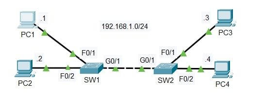

# Lab: Ethernet LAN Switching

**Date:** 2025-09-16  
**Tool:** Cisco Packet Tracer  
**Lab File:** `ethernet-lan-switching.pkt`

---

## 🎯 Objective
- Observe how switches learn MAC addresses dynamically.  
- Understand ARP broadcasts and the process of building a MAC address table.  
- Verify packet flow using **Simulation Mode** in Cisco Packet Tracer.  

---

## 📋 Lab Instructions
1. **Initial Condition**  
   - Both switches have empty MAC tables.  
   - All PCs have empty ARP tables.

2. **Ping Test**  
   - From **PC1**, ping **PC3** (`ping 192.168.1.3`).  
   - Predict which frames and broadcasts occur before the ping reply.

3. **Simulation Mode**  
   - Use **Simulation Mode** to watch ARP Requests/Replies and ICMP Echo/Reply packets.

4. **MAC Learning**  
   - Use pings between different PCs to generate traffic and allow SW1 and SW2 to learn all MAC addresses.

5. **Verification**  
   - On each switch, run:  
     ```
     show mac address-table
     ```
     to list dynamically learned MAC addresses.

6. **Clear Tables**  
   - To clear dynamic entries:  
     ```
     clear mac address-table dynamic
     ```

---

## 📝 Lab Topology
- Network: **192.168.1.0/24**  
- Devices: **PC1, PC2, PC3, PC4, SW1, SW2**  
- Connections:  
  - PC1 → SW1 (F0/1)  
  - PC2 → SW1 (F0/2)  
  - SW1 G0/1 → SW2 G0/1  
  - PC3 → SW2 (F0/1)  
  - PC4 → SW2 (F0/2)



---

## 🔧 Steps Performed
1. Opened `ethernet-lan-switching.pkt` in Cisco Packet Tracer.  
2. Verified that all switches and PCs had empty MAC/ARP tables.  
3. From PC1, sent a ping to PC3.  
   - **Observation:** An ARP Request broadcast went to all devices.  
   - PC3 replied with an ARP Reply, allowing PC1 to learn PC3’s MAC.  
   - ICMP Echo/Reply packets followed using the learned MAC addresses.  
4. Checked MAC tables on SW1 and SW2 using `show mac address-table`.  
   - Verified that the correct MAC entries were dynamically learned.  
5. Cleared the tables with `clear mac address-table dynamic` to return to the initial state.

---

## ✅ Result
- Successfully observed ARP broadcasts and MAC address learning.  
- Switches dynamically built their MAC address tables as pings were sent.  
- Simulation Mode clearly showed frame forwarding and learning behavior.

---

## 📂 Files in this folder
- `ethernet-lan-switching.pkt` → Packet Tracer lab file  
- `topology.jpg` → Final topology screenshot  
- `README.md` → Lab documentation  
