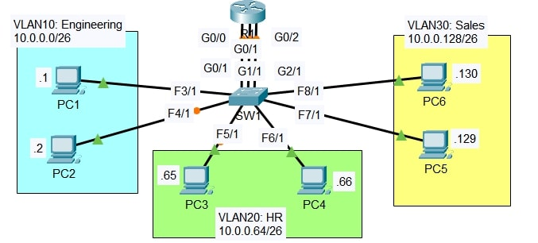

# Lab: VLAN Inter VLAN Routing

**Date:** 25 Nov 2025 
**Tool:** Cisco Packet Tracer  
**Lab File:** `vlan_inter-routing.pkt`

---

## 🎯 Objective
- Understand **VLAN segmentation**.
- Configure **Inter-VLAN Routing using multiple router interfaces**.
- Practice **IP addressing with subnetting**.
- Verify **broadcast behavior within VLANs**.

---

## 📋 Lab Instructions
1. Configure IP address and subnet mask on each PC.
   - Use the **LAST usable IP address** of each subnet as the **default gateway**.
2. Create **three physical connections** between **Router R1** and **Switch SW1**.
   - Configure **one router interface per VLAN**.
   - Router interface IPs must match the **gateway IPs** used on PCs.
3. Configure **SW1 interfaces** in the correct VLANs.
   - Ensure interfaces connected to **R1 are access ports**, not trunks.
4. Create and name VLANs:
   - VLAN 10 → Engineering  
   - VLAN 20 → HR  
   - VLAN 30 → Sales
5. Test connectivity:
   - Ping between PCs in different VLANs.
   - Send a **broadcast ping** from a PC and observe which devices receive it using **Simulation Mode**.

---

## 📝 VLAN and IP Addressing Plan

| VLAN | Department  | Network Address | Subnet Mask |
|------|------------|-----------------|-------------|
| 10   | Engineering | 10.0.0.0/26     | 255.255.255.192 |
| 20   | HR          | 10.0.0.64/26    | 255.255.255.192 |
| 30   | Sales       | 10.0.0.128/26   | 255.255.255.192 |

**Gateway IPs (Last Usable):**
- VLAN 10 → 10.0.0.62  
- VLAN 20 → 10.0.0.126  
- VLAN 30 → 10.0.0.190  

---

## 📝 Lab Topology

### Final Topology

---

## 🔧 Steps Performed
1. Created VLANs 10, 20, and 30 on SW1 and assigned names.
2. Assigned switch access ports to the correct VLANs.
3. Configured three separate router interfaces:
   - One interface per VLAN.
4. Assigned IP addresses to PCs based on their VLAN subnet.
5. Set default gateways on PCs to the router interface IPs.
6. Verified inter-VLAN connectivity using ICMP ping.
7. Verified broadcast isolation using Packet Tracer **Simulation Mode**.

---

## ✅ Result
- PCs within the **same VLAN** received broadcasts.
- PCs in **different VLANs** did **not** receive broadcasts.
- Inter-VLAN communication worked successfully via **Router R1**.

---

## 📂 Files in this folder
- `vlan_inter-routing.pkt` → Packet Tracer lab file  
- `topology.jpg` → Final topology screenshot  
- `README.md` → Lab documentation  
