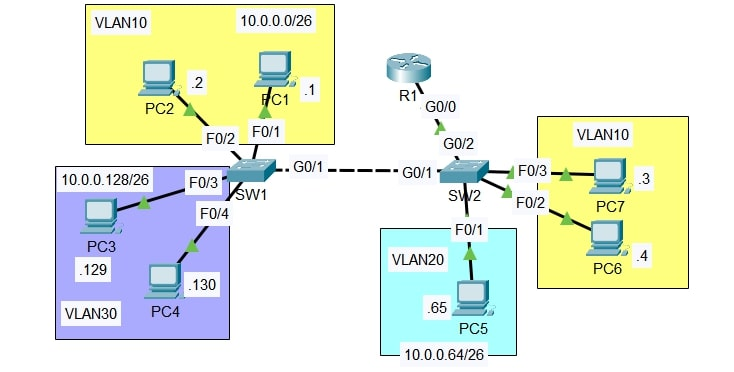

# Lab: VLAN Trunking & Inter VLAN Routing

**Date:** 27 Nov 2025  
**Tool:** Cisco Packet Tracer  
**Lab File:** `vlan_trunking_&_inter_vlan_routing.pkt`

---

## 🎯 Objective
- Configure **VLANs across multiple switches**.
- Implement **Router-on-a-Stick (ROAS)** for inter-VLAN routing.
- Configure **802.1Q trunk links** between switches and router.
- Verify **end-to-end connectivity across VLANs**.

---

## 📋 Lab Instructions
1. Configure switch interfaces connected to PCs as **access ports** in the correct VLAN.
2. Configure the link between **SW1 and SW2** as a **trunk**.
   - Allow only required VLANs.
   - Configure an **unused VLAN as the native VLAN**.
   - Ensure **all necessary VLANs exist on both switches**.
3. Configure the link between **SW2 and R1** using **Router-on-a-Stick**.
   - Create subinterfaces on R1.
   - Assign the **LAST usable IP address** of each subnet to R1 subinterfaces.
4. Test connectivity:
   - Ping between PCs in different VLANs.
   - All PCs should be able to reach each other.

---

## 📝 VLAN and IP Addressing Plan

| VLAN | Department  | Network Address | Subnet Mask |
|------|------------|-----------------|-------------|
| 10   | Engineering | 10.0.0.0/26     | 255.255.255.192 |
| 20   | HR          | 10.0.0.64/26    | 255.255.255.192 |
| 30   | Sales       | 10.0.0.128/26   | 255.255.255.192 |

**Gateway IPs (Last Usable):**
- VLAN 10 → 10.0.0.62  
- VLAN 20 → 10.0.0.126  
- VLAN 30 → 10.0.0.190  

---

## 📝 Lab Topology

### Final Topology

---

## 🔧 Steps Performed
1. Created VLANs 10, 20, and 30 on **SW1 and SW2**.
2. Assigned PC-facing ports as **access ports** in the appropriate VLANs.
3. Configured **SW1–SW2** link as an **802.1Q trunk**, allowing only required VLANs.
4. Configured **SW2–R1** link as a trunk for Router-on-a-Stick.
5. Created router subinterfaces:
   - One subinterface per VLAN with 802.1Q encapsulation.
6. Assigned IP addresses to PCs and configured default gateways.
7. Verified inter-VLAN connectivity using ICMP ping.

---

## ✅ Result
- PCs across **different VLANs successfully communicated**.
- VLAN separation was maintained at Layer 2.
- Inter-VLAN routing was achieved via **Router-on-a-Stick** on R1.

---

## 📂 Files in this folder
- `vlan_trunking_&_inter_vlan_routing.pkt` → Packet Tracer lab file  
- `topology.jpg` → Final topology screenshot  
- `README.md` → Lab documentation  
