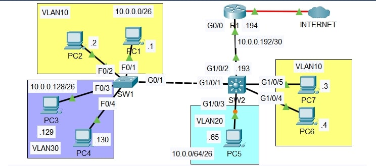

# Lab: Layer 3 Switching & Inter VLAN Routing

**Date:** 01 Dec 2025  
**Tool:** Cisco Packet Tracer  
**Lab File:** `layer-3_switching_&_inter-vlan_routing.pkt`

---

## 🎯 Objective
- Replace **Router-on-a-Stick** with **Layer 3 switching**.
- Configure **SVIs (Switched Virtual Interfaces)** for inter-VLAN routing.
- Implement a **point-to-point Layer 3 link** between switch and router.
- Verify **internal and Internet connectivity**.

---

## 📋 Lab Instructions
1. Replace the ROAS configuration between **R1 and SW2** with a **point-to-point Layer 3 connection**.
   - Use the IP addresses shown in the network diagram.
   - Configure a **default route on SW2** pointing to **R1 G0/0**.
2. Configure **SVIs on SW2**, one for each VLAN.
   - Assign the **LAST usable IP address** of each subnet to the corresponding SVI.
3. Test **inter-VLAN connectivity** by pinging between VLANs.
4. Test **Internet connectivity** by pinging **1.1.1.1**.
   - Routes are preconfigured on R1 and the Internet router.

---

## 📝 VLAN and IP Addressing Plan

| VLAN | Department  | Network Address | Subnet Mask |
|------|------------|-----------------|-------------|
| 10   | Engineering | 10.0.0.0/26     | 255.255.255.192 |
| 20   | HR          | 10.0.0.64/26    | 255.255.255.192 |
| 30   | Sales       | 10.0.0.128/26   | 255.255.255.192 |

**SVI Gateway IPs (Last Usable):**
- VLAN 10 → 10.0.0.62  
- VLAN 20 → 10.0.0.126  
- VLAN 30 → 10.0.0.190  

**Point-to-Point Link (SW2 ↔ R1):**
- Network: 10.0.0.192/30  
- SW2 → 10.0.0.193  
- R1  → 10.0.0.194  

---

## 📝 Lab Topology

### Final Topology

---

## 🔧 Steps Performed
1. Removed Router-on-a-Stick configuration between R1 and SW2.
2. Configured **Layer 3 interfaces** on SW2 and R1 for the point-to-point link.
3. Enabled **IP routing** on SW2.
4. Created SVIs for VLANs 10, 20, and 30 on SW2.
5. Assigned SVI IP addresses as default gateways for hosts.
6. Configured a **default route on SW2** pointing to R1.
7. Verified inter-VLAN and Internet connectivity using ICMP ping.

---

## ✅ Result
- Inter-VLAN routing was successfully handled by **SW2 (Layer 3 switch)**.
- All VLANs could communicate with each other.
- Hosts successfully accessed the Internet via **R1**.

---

## 📂 Files in this folder
- `layer-3_switching_&_inter-vlan_routing.pkt` → Packet Tracer lab file  
- `topology.jpg` → Final topology screenshot  
- `README.md` → Lab documentation  
