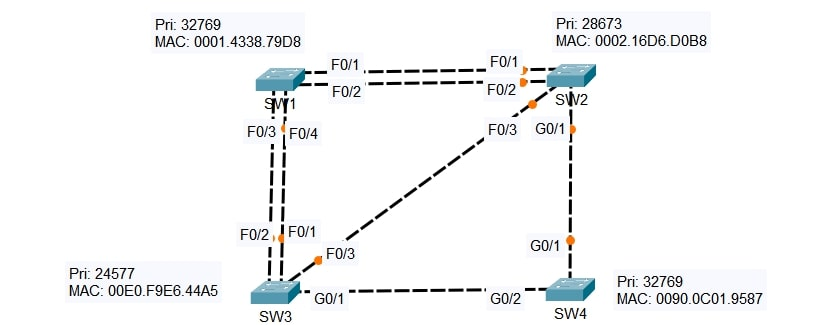

# Lab: STP Root & Port Role Analysis

**Date:** 05 Dec 2025  
**Tool:** Cisco Packet Tracer  
**Lab File:** `stp_root_&_port_role_analysis.pkt`

---

## 🎯 Objective
- Understand **Spanning Tree Protocol (STP)** operation.
- Identify the **Root Bridge** based on priority and MAC address.
- Determine **port roles**:
  - Root Port
  - Designated Port
  - Non-Designated (Blocking) Port
- Verify STP behavior using the **CLI**.

---

## 📋 Lab Instructions
1. Disable link lights in Packet Tracer:
   - `Options > Preferences > Show Link Lights` (Turn OFF)
2. Observe switch **Bridge Priority and MAC addresses**.
3. Identify the **Root Bridge**.
4. Determine the role of each switch port:
   - Root / Designated / Non-Designated
5. Confirm all answers using **CLI commands**.

---

## 🧠 STP Bridge Information

| Switch | Priority | MAC Address |
|-------|----------|-------------|
| SW1   | 32769    | 0001.4338.79D8 |
| SW2   | 28673    | 0002.16D6.D0B8 |
| SW3   | 24577    | 00E0.F9E6.44A5 |
| SW4   | 32769    | 0090.0C01.9587 |

---

## 📝 Lab Topology

### Final Topology

---

## 🔍 Tasks Performed
- Identified the **Root Bridge** based on lowest bridge ID.
- Determined **path costs** toward the root.
- Assigned port roles for each switch:
  - **Root Port** → Lowest cost path to root
  - **Designated Port** → Best path on a segment
  - **Non-Designated Port** → Blocked to prevent loops
- Verified STP status using CLI commands:
  - `show spanning-tree`
  - `show spanning-tree interface`

---

## 🧩 Ports to Analyze

**SW1**
- F0/1  
- F0/2  
- F0/3  
- F0/4  

**SW2**
- F0/1  
- F0/2  
- F0/3  
- G0/1  

**SW3**
- F0/1  
- F0/2  
- F0/3  
- G0/1  

**SW4**
- G0/1  
- G0/2  

---

## ✅ Result
- The **Root Bridge** was correctly identified.
- All switch ports were assigned correct STP roles.
- Layer 2 loops were successfully prevented by STP.
- Port roles were confirmed via **CLI verification**.

---

## 📂 Files in this folder
- `stp_root_&_port_role_analysis.pkt` → Packet Tracer lab file  
- `topology.jpg` → Final topology screenshot  
- `README.md` → Lab documentation  
