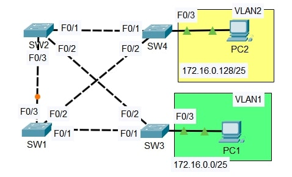

# Lab: Per-VLAN Spanning Tree (PVST) Optimization

**Date:** 08 Dec 2025  
**Tool:** Cisco Packet Tracer  
**Lab File:** `per_vlan_stp_optimization.pkt`

---

## 🎯 Objective
- Analyze the **default STP topology** using CLI.
- Configure **different root bridges per VLAN** using PVST+.
- Modify **STP path cost and port priority** to influence root port selection.
- Implement **PortFast and BPDU Guard** on access ports.

---

## 📋 Lab Instructions
1. Use the CLI to inspect the current STP topology.
   - Identify the **current root bridge**.
   - Determine the **STP role/state of each port** on all switches.
2. Configure:
   - **SW1** as the **primary root for VLAN 1** and **secondary root for VLAN 2**.
   - **SW2** as the **primary root for VLAN 2** and **secondary root for VLAN 1**.
   - Observe changes in port roles and states.
3. Increase the **VLAN 1 cost** of **SW4 F0/2** to `100`.
   - Determine whether SW4 selects a different root port and explain why.
4. Increase the **VLAN 1 port priority** of **SW1 F0/1** to `240`.
   - Determine whether SW3 selects a different root port and explain why.
5. Configure **PortFast and BPDU Guard** on **F0/3 interfaces of SW3 and SW4**.

---

## 📝 VLAN and IP Addressing Plan

| VLAN | Network Address     | Subnet Mask |
|------|---------------------|-------------|
| 1    | 172.16.0.0/25       | 255.255.255.128 |
| 2    | 172.16.0.128/25     | 255.255.255.128 |

---

## 📝 Lab Topology

### Final Topology

---

## 🔧 Steps Performed
1. Verified the initial STP topology using:
   - `show spanning-tree`
   - `show spanning-tree vlan 1`
   - `show spanning-tree vlan 2`
2. Configured per-VLAN root bridge priorities on SW1 and SW2.
3. Observed STP reconvergence and updated port roles.
4. Modified STP **path cost** on SW4 F0/2 for VLAN 1.
5. Modified STP **port priority** on SW1 F0/1 for VLAN 1.
6. Enabled **PortFast** and **BPDU Guard** on access ports connected to end devices.
7. Verified final STP state using CLI.

---

## ✅ Result
- Different **root bridges were successfully elected per VLAN**.
- STP path selection changed based on **cost and port priority adjustments**.
- Access ports were hardened using **PortFast and BPDU Guard**.
- Layer 2 loops were prevented while maintaining optimal forwarding paths.

---

## 📂 Files in this folder
- `per_vlan_stp_optimization.pkt` → Packet Tracer lab file  
- `topology.jpg` → Final topology screenshot  
- `README.md` → Lab documentation  
