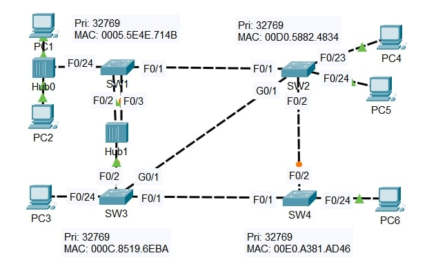

# Lab: Rapid Spanning Tree Protocol (RSTP) – Port Roles and Link Types

**Date:** 12 Dec 2025 
**Tool:** Cisco Packet Tracer  
**Lab File:** `rstp_port_roles_link_types.pkt`

---

## 🎯 Objective
- Analyze **RSTP (802.1w)** behavior in a multi-switch topology.
- Identify the **Root Bridge** and observe its port roles.
- Compare **RSTP port roles/states** with traditional STP.
- Manually configure appropriate **RSTP link types**.
- Understand the impact of **shared vs point-to-point links**.

---

## 📋 Lab Instructions
1. Identify the **Root Bridge**.
   - Use the CLI to examine the **port role/state of each interface on the root**.
   - Identify what appears **different from classic STP** behavior and explain why.
2. Without using the CLI:
   - Determine the **RSTP role/state** of each remaining switch interface.
   - Use the CLI to **confirm your answers**.
3. Manually configure the correct **RSTP link type** on each interface.
   - Determine the appropriate **link type for SW1 F0/24** and justify the choice.

---

## 🧠 RSTP Concepts Applied
- Root Port  
- Designated Port  
- Alternate Port  
- Edge Port  
- Point-to-Point Links  
- Shared Links  

---

## 📝 Lab Topology

### Final Topology

---

## 🔧 Steps Performed
1. Verified RSTP operation using:
   - `show spanning-tree`
   - `show spanning-tree interface`
2. Identified the **Root Bridge** based on Bridge ID.
3. Observed **RSTP-specific port roles** (including Alternate ports).
4. Compared RSTP port states with traditional STP behavior.
5. Manually configured **RSTP link types**:
   - Point-to-point
   - Shared
   - Edge
6. Verified correct RSTP convergence and port states using CLI.

---

## ✅ Result
- The Root Bridge was correctly identified.
- RSTP port roles and states were accurately determined.
- Appropriate **RSTP link types** were configured on all interfaces.
- Faster convergence behavior of RSTP was successfully observed.

---

## 📂 Files in this folder
- `rstp_port_roles_link_types.pkt` → Packet Tracer lab file  
- `topology.jpg` → Final topology screenshot  
- `README.md` → Lab documentation  
