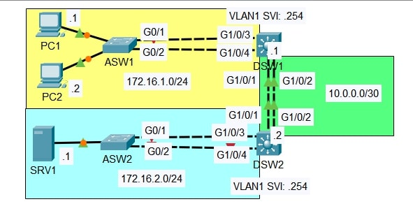

# Lab: EtherChannel Configuration and Load Balancing

**Date:** 15 Dec 2025
**Tool:** Cisco Packet Tracer  
**Lab File:** `etherchannel_configuration_load_balancing.pkt`

---

## 🎯 Objective
- Configure **Layer 2 EtherChannel** using different negotiation protocols.
- Configure **Layer 3 EtherChannel** between distribution switches.
- Understand and verify **EtherChannel load-balancing methods**.
- Ensure **end-to-end connectivity** across aggregated links.

---

## 📋 Lab Instructions
1. Configure a **Layer 2 EtherChannel** between **ASW1 and DSW1** using **LACP**.
   - Configure the EtherChannel as a **trunk**.
2. Configure a **Layer 2 EtherChannel** between **ASW2 and DSW2** using **PAgP**.
   - Configure the EtherChannel as a **trunk**.
3. Configure a **Layer 3 EtherChannel** between **DSW1 and DSW2** using **static EtherChannel**.
4. Configure routing to allow **PCs to reach SRV1**.
5. Identify the **default EtherChannel load-balancing method** on each switch.
6. Reconfigure the switches to **load-balance based on source and destination IP addresses**.

---

## 📝 IP Addressing Overview

| Segment | Network |
|--------|---------|
| VLAN 1 (ASW1 PCs) | 172.16.1.0/24 |
| VLAN 1 (ASW2 Server) | 172.16.2.0/24 |
| DSW1–DSW2 L3 Link | 10.0.0.0/30 |

**Notes:**
- End-host IP addresses and SVI addresses are **preconfigured**.
- VLAN 1 SVI address on distribution switches: `.254`.

---

## 📝 Lab Topology

### Final Topology

---

## 🔧 Steps Performed
1. Configured LACP-based Layer 2 EtherChannel between ASW1 and DSW1.
2. Configured PAgP-based Layer 2 EtherChannel between ASW2 and DSW2.
3. Configured a static Layer 3 EtherChannel between DSW1 and DSW2.
4. Verified EtherChannel status using:
   - `show etherchannel summary`
   - `show interfaces port-channel`
5. Configured routing to ensure connectivity between PCs and SRV1.
6. Verified default EtherChannel load-balancing method.
7. Modified load-balancing to use **source and destination IP addresses**.
8. Verified traffic distribution across member links.

---

## ✅ Result
- EtherChannel links successfully formed using **LACP, PAgP, and static modes**.
- Layer 2 and Layer 3 EtherChannels operated correctly.
- End-to-end connectivity between PCs and SRV1 was achieved.
- Traffic load was effectively distributed across bundled links.

---

## 📂 Files in this folder
- `etherchannel_configuration_load_balancing.pkt` → Packet Tracer lab file  
- `topology.jpg` → Final topology screenshot  
- `README.md` → Lab documentation  
