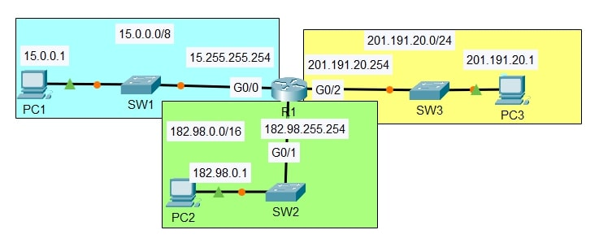

# Lab: IPv4 Addressing & Router Interface Configuration

**Date:** 2025-09-16  
**Tool:** Cisco Packet Tracer  
**Lab File:** `ipv4-addressing.pkt`

---

## 🎯 Objective
- Configure IPv4 addresses on a router and end devices.  
- Enable and verify router interfaces.  
- Test connectivity across three different networks using pings.  

---

## 📋 Lab Instructions
1. **Router Hostname**  
   - Configure the router’s hostname as **R1**.

2. **View Interfaces**  
   - Use a `show` command to display R1’s interfaces, IP addresses, and status.

3. **Interface Configuration**  
   - Assign the correct IP addresses to R1’s interfaces and enable them.  
   - Add suitable interface descriptions.

4. **Verify Interfaces**  
   - Use `show ip interface brief` (or similar) to confirm IPs and status.

5. **Save Configuration**  
   - Check the running configuration, then save it to startup config.

6. **PC IP Configuration**  
   - Set the following IPv4 addresses on each PC:  
     - **PC1:** 15.0.0.1 /8, Gateway 15.255.255.254  
     - **PC2:** 182.98.0.1 /16, Gateway 182.98.255.254  
     - **PC3:** 201.191.20.1 /24, Gateway 201.191.20.254

7. **Connectivity Test**  
   - Ping from PC1 to PC2 and PC3 to confirm end-to-end communication.

---

## 📝 Lab Topology
- **Networks**
  - 15.0.0.0/8  → PC1 ↔ SW1 ↔ R1 G0/0
  - 182.98.0.0/16 → PC2 ↔ SW2 ↔ R1 G0/1
  - 201.191.20.0/24 → PC3 ↔ SW3 ↔ R1 G0/2
- **Router R1 Interfaces**
  - G0/0 → 15.255.255.254
  - G0/1 → 182.98.255.254
  - G0/2 → 201.191.20.254



---

## 🔧 Steps Performed
1. Opened `ipv4-addressing.pkt` in Cisco Packet Tracer.  
2. Entered global configuration mode and set the router hostname to `R1`.  
3. Checked interfaces with `show ip interface brief`.  
4. Configured IP addresses and enabled each interface:  
   ```
   interface g0/0
     ip address 15.255.255.254 255.0.0.0
     no shutdown
   interface g0/1
     ip address 182.98.255.254 255.255.0.0
     no shutdown
   interface g0/2
     ip address 201.191.20.254 255.255.255.0
     no shutdown
   ```
5. Verified status again using `show ip interface brief`.  
6. Saved configuration with `write memory`.  
7. Configured static IPs and gateways on PC1, PC2, and PC3.  
8. Tested connectivity by pinging between all PCs—successful replies confirmed routing.

---

## ✅ Result
- Router R1 successfully configured with IPv4 addresses and enabled interfaces.  
- All three PCs communicated across different networks via R1.  
- Pings between PC1, PC2, and PC3 were successful.

---

## 📂 Files in this folder
- `ipv4-addressing.pkt` → Packet Tracer lab file  
- `topology.jpg` → Final topology screenshot  
- `README.md` → Lab documentation  

