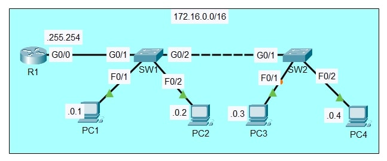

# Lab: Switches & Interface Configuration

**Date:** 2025-09-16  
**Tool:** Cisco Packet Tracer  
**Lab File:** `switches-interface.pkt`

---

## 🎯 Objective
- Configure hostnames on router and switches.  
- Assign IPv4 addresses to router and PCs.  
- Manually set speed and duplex on inter-device connections.  
- Add descriptions on interfaces and disable unused ports.

---

## 📋 Lab Instructions
1. **Hostnames**  
   - Set the hostname of the router to **R1**, and the switches to **SW1** and **SW2**.

2. **IP Addressing**  
   - Configure these IPv4 addresses:
     - **Router R1 (G0/0):** 172.16.0.255 255.255.0.0  
     - **PC1:** 172.16.0.1 255.255.0.0, Gateway 172.16.0.255  
     - **PC2:** 172.16.0.2 255.255.0.0, Gateway 172.16.0.255  
     - **PC3:** 172.16.0.3 255.255.0.0, Gateway 172.16.0.255  
     - **PC4:** 172.16.0.4 255.255.0.0, Gateway 172.16.0.255  

3. **Speed & Duplex**  
   - Manually configure speed and duplex on interfaces connecting networking devices (router–switch and switch–switch).  
   - Example:
     ```
     interface g0/1
       speed 1000
       duplex full
     ```

4. **Interface Descriptions**  
   - Add descriptions on all active interfaces (e.g., `description Link to SW1`).

5. **Disable Unused Interfaces**  
   - Shut down interfaces that are not connected:
     ```
     interface range f0/3 - 24
       shutdown
     ```

---

## 📝 Lab Topology
- **Network:** 172.16.0.0/16  
- **Devices:** R1, SW1, SW2, PC1, PC2, PC3, PC4  
- **Connections:**  
  - PC1 → SW1 (F0/1)  
  - PC2 → SW1 (F0/2)  
  - SW1 G0/2 → SW2 G0/1  
  - PC3 → SW2 (F0/1)  
  - PC4 → SW2 (F0/2)  



---

## 🔧 Steps Performed
1. Opened `switches-interface.pkt` in Cisco Packet Tracer.  
2. Configured hostnames for R1, SW1, and SW2.  
3. Assigned IP addresses to R1 and all PCs.  
4. Set speed and duplex manually on router–switch and switch–switch connections.  
5. Added descriptive labels to each active interface.  
6. Disabled all unused switch ports for security.  
7. Verified configuration with:
   ```
   show running-config
   show ip interface brief
   ```
8. Tested connectivity between PCs with ping—successful replies confirmed proper setup.

---

## ✅ Result
- Router and switches were correctly named and configured.  
- IPv4 addressing, speed/duplex settings, and interface descriptions applied successfully.  
- Unused ports were disabled and network connectivity between all PCs was verified.

---

## 📂 Files in this folder
- `switches-interface.pkt` → Packet Tracer lab file  
- `topology.jpg` → Final topology screenshot  
- `README.md` → Lab documentation  
